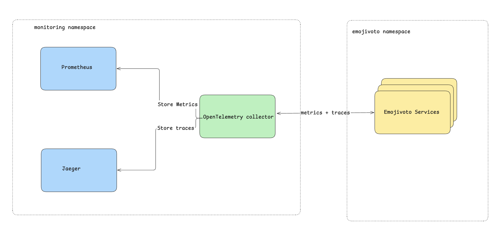

## Current Installation

When launched, the sandbox automatically installs the following:
- `emojivoto` services are all installed in the `emojivoto` namespace
- `Traces` + `metrics` are collected from the service using the `open-telemetry-operator` installed in the `monitoring` namespace
- `Traces` are stored in `jaeger` on port `4317`. Jaeger's UI is accessible via a corresponding `NodePort` service
- `Metrics` are stored in `prometheus` that scrapes the opentelemetry collector on port `9999`. The UI is also accessible via a `NodePort` service



## Exercise

*Useful tips about this exercise and killercoda*:
- You can create / update any file you want
- You are allowed to use an LLM to generate configuration
- All installed files are inside the `/root/exercise` directory
- There is an `editor` (on the top left) that opens a VSCode in the `/root` directory
- The `traffic/ports` window (on the dropdown in the top right) that will allow you to get use `NodePort` services to visualize Jaeger / Prometheus

### Fix OpenTelemetry's target allocator crashing

When installing the cluster we apply the `OpenTelemetryCollector` that was given to us in the `/root/exercise/otel-collector.yaml` file, both the collector and the target-allocator are ending up in `Error` / `CrashLoopBackoff`.

This happens because the `target-allocator` is missing the proper rights to do things (cf: the pods' logs).

**We want to fix it !**

To help you here's the set of rights needed by the target allocator:

```yaml
- apiGroups: [""]
  resources:
  - nodes
  - nodes/metrics
  - services
  - endpoints
  - pods
  - secrets
  - namespaces
  verbs: ["get", "list", "watch"]
- apiGroups: [""]
  resources:
  - configmaps
  verbs: ["get"]
- apiGroups:
  - discovery.k8s.io
  resources:
  - endpointslices
  verbs: ["get", "list", "watch"]
- apiGroups:
  - networking.k8s.io
  resources:
  - ingresses
  verbs: ["get", "list", "watch"]
- apiGroups:
  - monitoring.coreos.com
  resources:
  - servicemonitors
  - podmonitors
  - probes
  - scrapeconfigs
  verbs:
  - '*'
- nonResourceURLs: ["/metrics"]
  verbs: ["get"]
```

### Update the OpenTelemetryCollector configuration

For the sake of having an up & running `OpenTelemetryCollector`, we created an "empty" one with a lot of `TODO`.

We know want to update the `/root/exercise/otel-collector.yaml` file to make sure our telemetry data is received correctly and exported to the correct databases depending if it's a trace or a metric.

### Add all necessary configuration to have our metrics / traces sent to opentelemetry

Now that we should have a working configuration for our monitoring pipeline, we want to monitor our services by using their metrics / traces:
- We want to add some prometheus-related configuration to scrape data on all of our services:
  - every `30 seconds`
  - on port `prom`
  - at the `/metrics` path

- We want to add proper tracing configuration so that a query made at the `web` service level gives us a trace with all backend services. Since `emojivoto` is written in golang ou'll probably need the following paths inside the container:
  - emoji-service executable path : `/usr/local/bin/emojivoto-emoji-svc`
  - voting executable path: `/usr/local/bin/emojivoto-voting-svc`
  - web executable path: `/usr/local/bin/emojivoto-web`

With all of those configurations done, you should now be able to see your metrics in `prometheus` and traces in `jaeger` 👌

EDIT: After setting up your application for traces, you might see your instrumentation container crashing with a `... version must be >= 5.6` kind of error. If it's happens you're done with traces, don't try to fix the issue: it's caused by killercoda using an old version of the linux Kernel (version 5.4 from 2019) which eBPF (the network protocol under opentelemetry tracing) doesn't support.